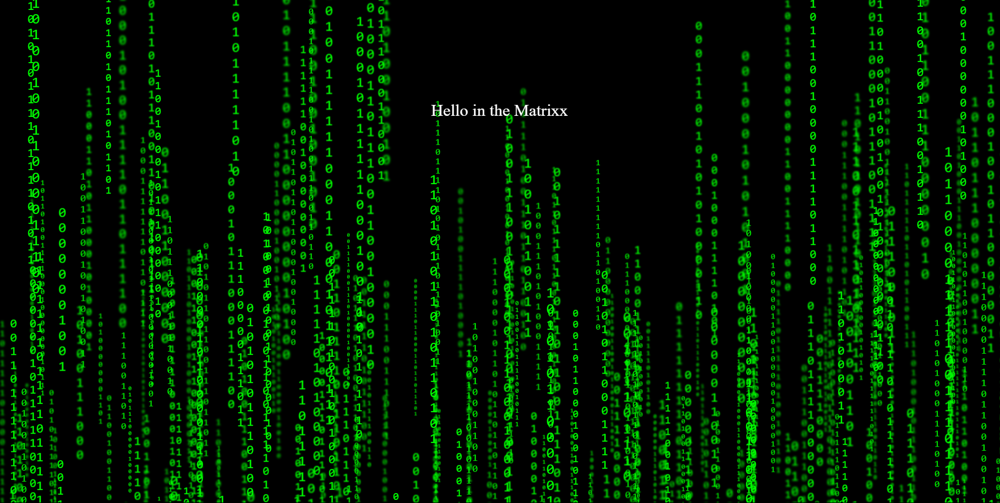
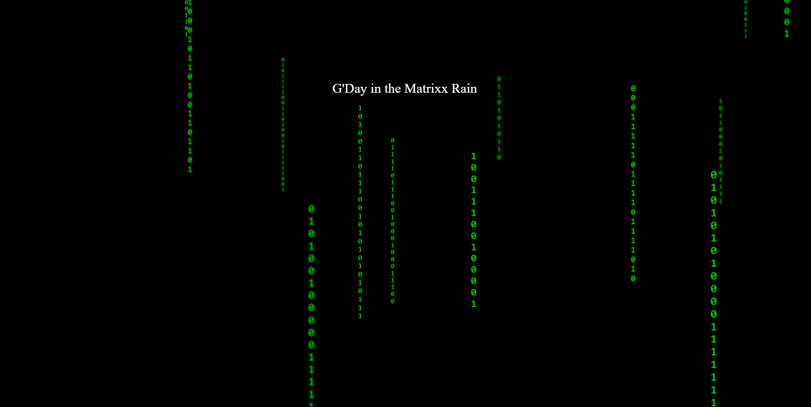
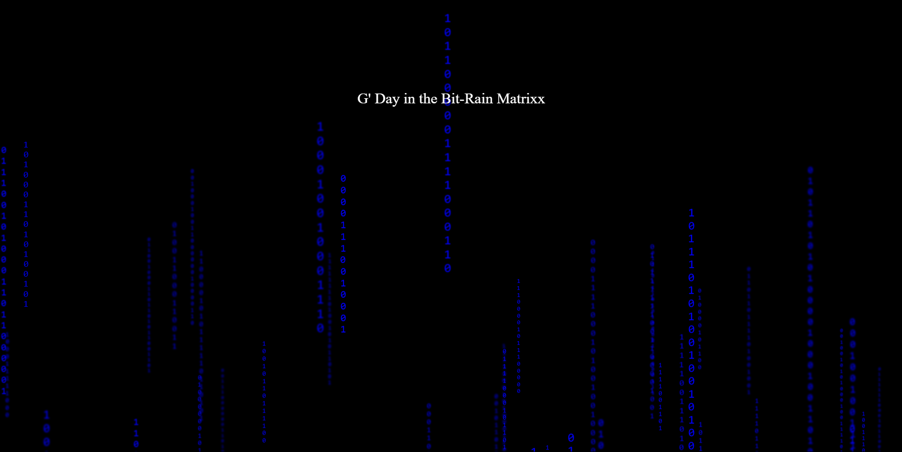
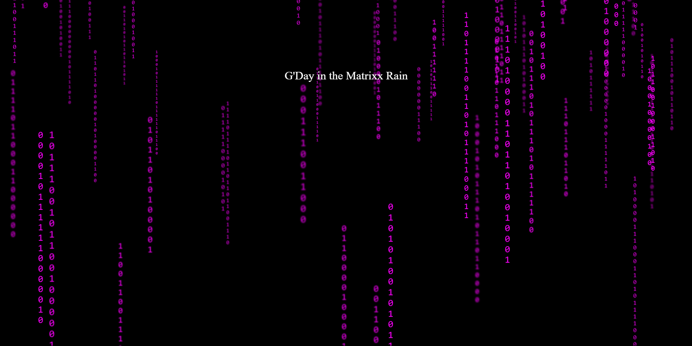

# 🟩 Matrixx Canvas Web Component

A lightweight, **zero-dependency**, native Web Component that renders an animated **Matrix-style binary rain** background using pure HTML, CSS, and JavaScript. It is easy to integrate into any frontend project without frameworks like React or Vue.

> Includes:
> - `<matrixx-canvas>` – manages the canvas and columns
> - `<bit-rain-column>` – represents an individual animated column of binary bits

---

## 📸 Screenshots

| Direction: Up | Direction: Down |
|---------------|-----------------|
| Density: Very High (10) | Density: Low (3) |
|  |  |
| BitsColor: blue | BitsColor: magenta |
|  |  |

> *Both screenshots captured using the `<matrixx-canvas>` component with different `direction` n `density` attributes.*

---

## 📦 Installation

You can install it via npm:

```bash
npm install matrixx-canvas
````

Or use it directly via CDN:

```html
<script type="module" src="https://unpkg.com/matrixx-canvas"></script>
```

---

## 🚀 Usage

### 1. Import the components

```html
<script type="module">
  import 'matrixx-canvas'; // If using a bundler or from dist
</script>
```

### 2. Use the `<matrixx-canvas>` tag

```html
<matrixx-canvas
  density="0.7"
  direction="down"
  limit="true"
></matrixx-canvas>
```

### 3. Example with content on top

```html
<body style="margin: 0; background: black;">
  <matrixx-canvas density="0.8" direction="up"></matrixx-canvas>

  <div style="position: relative; color: white; text-align: center; padding-top: 25vh;">
    <h1>Hello, Matrixx.</h1>
  </div>
</body>
```

### 4. Example with React

```jsx
import 'bitrain-matrixx';
export default function App() {
  return (
      <div style={{ background: "black", width: '100vw', height: '100vh' }}>
        <matrixx-canvas density="10" direction="down" bits-color='red' />
        <div
          style={{
            position: "relative",
            color: "white",
            textAlign: "center",
            paddingTop: "25vh",
          }}
        >
          <h1>Hello, Matrixx.</h1>
        </div>
      </div>
  )
}
```

---

## 🧩 Custom Element Reference

### `<matrixx-canvas>`

| Attribute   | Type               | Default | Description                                                                                               |
| ----------- | ------------------ | ------- | --------------------------------------------------------------------------------------------------------- |
| `density`   | `float`            | `4.0`   | Controls how many columns to render. Recommended: 0 \~ 10.                                                |
| `direction` | `"up"` \| `"down"` | `"up"`  | Direction of animation.                                                                                   |
| `bits-color` | `string`          | `#00ff00` | This optional flag affests what color will the bits be using, is not passed-in, it will be code-ish lime green. |
| `limit`     | `bool`             | `true`  | If `true`, restricts saver density within 0\~10. If `false`, higher values allowed, but may affect performance. |

---

## 🛠 Technologies Used

* **Web Components**: native `HTMLElement` extension via `customElements.define`
* **Shadow DOM**: fully encapsulated styles
* **CSS animations**: pure keyframe animations for performance
* **TypeScript**: strict typing and dev-time safety
* **No dependencies**: zero runtime overhead

---

## 📁 Project Structure

```
src/
├── bit-rain-column.ts   # <bit-rain-column> component
└── matrixx-canvas.ts    # <matrixx-canvas> component

dist/
└── *.js                 # compiled JS output

index.html               # test/demo page
tsconfig.json
package.json
README.md
```

---

## 🧪 Development & Testing

```bash
npm install
npx tsc
npx http-server .
# Then open http://localhost:8080
```

> You can also use Vite or any static dev server.

---

## 📄 License

Apache-2.0 License © 2025 Hanny Zhang

---

## 🙌 Acknowledgements

Inspired by the iconic "Matrix" falling code effect. Built to be fast, flexible, and framework-free.
